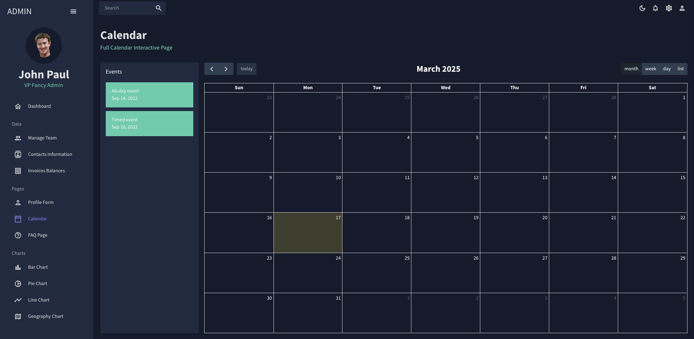
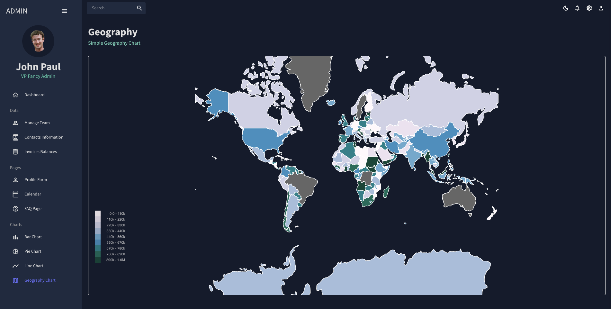

# React Admin Dashboard  

A modern **Admin Dashboard** built from scratch using **React, Material UI, Nivo Charts, Formik, Yup, FullCalendar, and Data Grid**.  
This project provides a fully responsive and interactive admin panel with **dark mode support, dynamic charts, data tables, form validation, and a calendar**.  

## 🚀 Features  

- ✅ **Light & Dark Mode** – Easily switch between themes.  
- ✅ **Interactive Charts** – Includes **4 different Nivo Charts** for data visualization.  
- ✅ **Data Tables** – 3 data table pages with **sorting, filtering, and pagination** (Data Grid).  
- ✅ **FAQ Page** – Frequently asked questions page for quick reference.  
- ✅ **Form Handling** – **Formik & Yup** for validation and form management.  
- ✅ **Calendar Integration** – **FullCalendar** for event scheduling and management.  

## 🛠️ Tech Stack  

- **React** – Frontend Framework  
- **Material UI** – UI Components & Theming  
- **Nivo Charts** – Data Visualization  
- **Formik & Yup** – Form Handling & Validation  
- **FullCalendar** – Calendar & Events Management  
- **Data Grid** – Efficient Table Management

## Screenshots

Here are some screenshots of the project:

